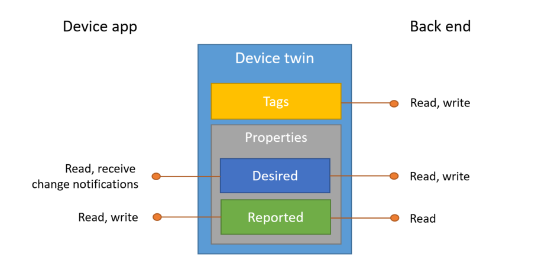

# Azure IOT Hub

## Model 

**Device** <---> **Azure IOT Hub** <---> **Device**

- Device (front-end, Things): Support MQTT, HTTP, AMQP protocols
- Azure IOT Hub (Cloud): Data Cache (IOT Hub), Data Filter, Data Storage, Data Analysis
- Device (back-end): Monitor data or control front-end devices

## SDK

- Device SDK
- Service SDK

Support C#, C, Java, Python, Node

## Steps

1. Create IOT Hub instance in portal.azure.cn
2. Connect the IOT Hub instance by Service SDK using **IOTHub ConntectionString**
3. Create a device by Service SDK
4. Connect IOT Hub instance by Device SDK by **Device ConnectionString**
5. Monitor Data /Send Messages by Service SDK

## Device SDK Features

- Send Messages to Cloud (D2C)
- Receive Messages from Cloud (C2D)
- Direct Device Method
- Device Twin roperties (RO/RW)

## Device Connection

1. Security Keys
   - Connection String
   - Shared Access Signature (SAS)
2. x509

For **Security Keys**, the client needs to provide **client.crt and client.key** implicitly and*provide **Hostname**, **DeviceId**, and **Connection String or SAS (finally to SAS)**  explicitly. 

For **x509**, the client needs to provide **Hostname**, **DeviceId**, **client.crt and client.key** explicitly.

> ConnectionString is persitent. 
> SAS and x509 are transient with TTL (Time To Live)

## Security connection Internals

### TLS handshake process 

> prerequest: certificate/key, requestCert/rejectUnathorized

- Client (Device)
  - requestCert = ture (**MUST BE**)
  - rejectUnauthorized = true (SDK)

So the certificate provided by Server must be CA authorized.

- Server (MQTT server)
  - requestCert = ture
  - rejectUnauthorized = false

So the client must provide certificate and key, but the certificaate can be authoirzed by ownself.

### Ruff devices are secure with the same private key ?

Since SAS is unidirectional from Client to Server. The Server certificate is authorized by CA (with addtional infomation such as hostname). Others can not pretend to be Server in order to get the SAS client sent.

## Ruff porting

### device connection does NOT support ConnectionString 

It needs to cipher ConnectionString to SAS with HMAC sha256 algorithm. But ruff does NOT provide crypto module. And crypto-js has bug for HMAC sha256 (secret parameter is string, not Buffer)

### TLS Bugs

- Load default client.crt and client.key if no external feed
- Return value for ssl write
- Accept string type and convert to Buffer for external crt/key parameters 

### Size Reduction (2.5M modules and 750K package now)

- Disable upload blob storage API (azure-storage)
- Remove useless modules such as es5-shim
- Use nesscessary core modules (lodash at/merge) instead of whole lodash module
- Make dependent modules (traverse/machina etc.) inside
- Use the minimum required version lodash (3.0.1) for machina

### TODO

- Create crypto module for Ruff using mbedtls
- Wait for crypto-js HMAC-sha256 bug fix
- Wait for rap install/deploy improvement and bug fix (2.2M and 690K finally) 
